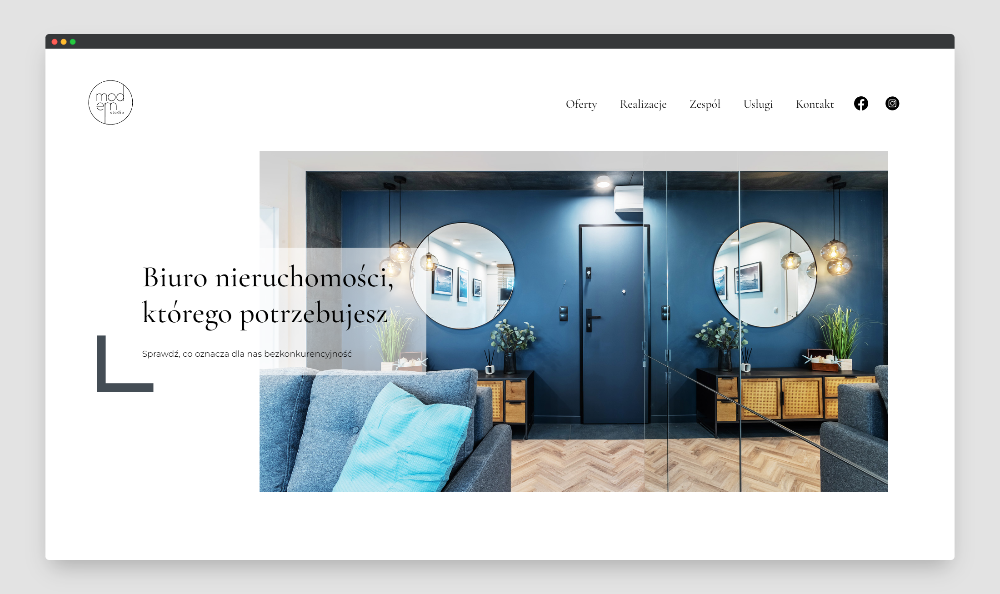

# Hello Roman - Projekt od A do Z

## Project prupose

**Moder Studio** is a project created based on the `"Project from A to Z"` course from the [hello roman](https://www.youtube.com/channel/UCq8XmOMtrUCb8FcFHQEd8_g) channel, resulting from a collaboration with [Modern Studio](https://www.msnieruchomosci.pl/), a company that stands out for its innovative approach to real estate and investment topics.



The repository is divided into separate branches based on the **22** available lessons, which will show you how to create a project for a real company from start to finish. The course includes:

- client consultation
- creating wireframes and designing the website in Figma
- writing copy and selecting images for the site
- implementing the project using the Gatsby framework with Contentful
- automatic deployment of the application (in my case, using Github/Netlify/Contentful)

The `main` branch contains additional features not covered in the course, while the last branch related to the course is called `refactor`.

## How to run?

**1. Clone this repository:**

```
git clone https://github.com/KoTubA/modern-studio.git
```

or:

```
git clone git@github.com:KoTubA/modern-studio.git
```

**2. Install npm packages:**

```sql
npm install
```

**3. Start developing.**

Navigate into site’s directory and start it up.

```shell
cd modern-studio/
npm run develop
```

**4. Open the code and start customizing!**

The site is now running at http://localhost:8000

Edit `src` folder to see your site update in real-time!

**5. Learn more**

- [Documentation](https://www.gatsbyjs.com/docs/?utm_source=starter&utm_medium=readme&utm_campaign=minimal-starter)
- [Tutorials](https://www.gatsbyjs.com/docs/tutorial/?utm_source=starter&utm_medium=readme&utm_campaign=minimal-starter)
- [Guides](https://www.gatsbyjs.com/docs/how-to/?utm_source=starter&utm_medium=readme&utm_campaign=minimal-starter)
- [API Reference](https://www.gatsbyjs.com/docs/api-reference/?utm_source=starter&utm_medium=readme&utm_campaign=minimal-starter)
- [Plugin Library](https://www.gatsbyjs.com/plugins?utm_source=starter&utm_medium=readme&utm_campaign=minimal-starter)
- [Cheat Sheet](https://www.gatsbyjs.com/docs/cheat-sheet/?utm_source=starter&utm_medium=readme&utm_campaign=minimal-starter)

## Live demo

Link to demo: https://moder-studio.netlify.app/
